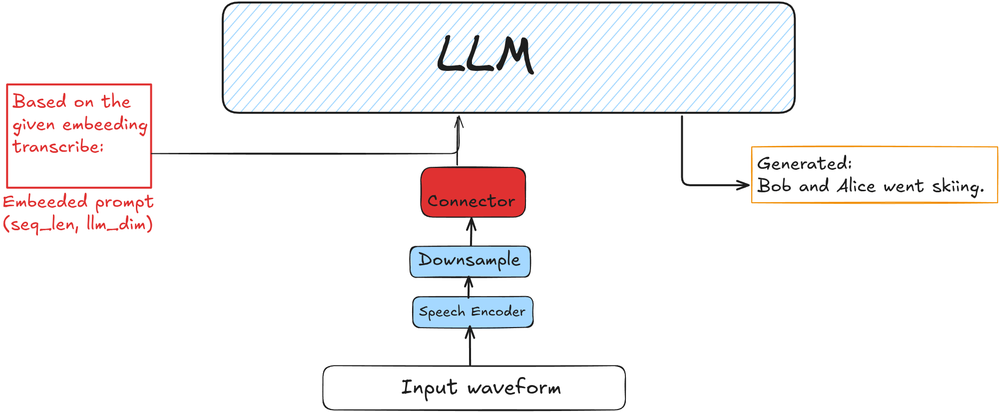

# MAC-ASR: Modular Audio Connector Repository for Single Speaker ASR. 

MAC-ASR is repository for end-to-end automatic speech recognition (ASR) that connects a frozen speech encoder to a frozen large language model (LLM) through a lightweight trainable connector. 

This repository is supposed to work as a starting point layout for anyone who wants to experiment with speech LLMs and space alligment.


```NOTE: This pipeline is known to have problems generalizing. Make sure you have a big mixture of datasets ready in order to make generalizable model. ``` 

No pull request will be accepted due to this being my bachelor's thesis.

## Architecture



The prompt template used during training and inference:

```
[Transcribe the following audio to text.\n\nAudio:] [speech embeddings] [\n\nTranscription:] [target text]
```

## Components

### Encoder

So far, the repository supports following encoders: 

| Name | Model | Output dim | Notes |
|------|-------|-----------|-------|
| `whisper` | `openai/whisper-large-v3` | 1280 | Frozen. Extracts mel-spectrogram features at 16 kHz. |

### Connector

The connector is the trainable component. It projects downsampled encoder embeddings into the LLM embedding space.

So far, the repository contains following connector options

| Name |
|------|
| `linear` | 
| `transformer` | 
| `qformer` | 

### LLM

| Name | Model | LLM Dim |
|------|-------|------------|
| `qwen` | `Qwen/Qwen3-1.7B` | 2048 |
| `gemma` | `google/gemma-3-1b-pt` | 1536 | 
| *any HF model ID* | Loaded via `AutoModelForCausalLM` | auto |

There might be some issues with loading models that f.e do not have padding or eos_token. Be aware of that


## Configuration

All settings are specified in a single TOML file. See [`config_example.toml`](config_example.toml) for a complete example.


## Training

Training supports DDP for distributed training. Only the connector parameters are optimized (encoder and LLM are frozen if lora is not used). The training loop includes:

- Gradient accumulation
- Linear warmup + cosine annealing LR schedule
- Early stopping based on validation WER + automatic delation of worse validation checkpoints
- Wandb logging

## Inspiration/Reference

- **SLAM-ASR** — *An Embarrassingly Simple Approach for LLM with Strong ASR Capacity* ([arXiv:2402.08846](https://arxiv.org/abs/2402.08846)). 

- **Qwen3-ASR** — *Qwen3-ASR Technical Report* ([arXiv:2601.21337](https://arxiv.org/abs/2601.21337))


## Known Issues

- I had trouble making ANY Muon optimizer work in these settings

- Hardcoded encoder parts and no support for processor.

- General LLMS do not work for now.
## Results

The config is public in file config_qwen.toml, it uses Qwen3-1.7B model. This checkpoint was trained on 7k hours of audio. Results with beam_search = 4:

| Dataset | Corpus WER |
|---------|-----------|
| common_voice | 9.89% |
| fisher + switchboard | 17.69% |
| how2_dev5 | 8.91% |
| how2_val | 9.68% |
| librispeech_clean | 2.76% |
| librispeech_other | 5.23% |

## Future work

I'll be extending this work for multiple-speakers without the need of diarization conditioning to the LLM.

## Author

Martin Vaculik (xvaculm00@stud.fit.vutbr.cz)

During the development of the software, AI-assisted programming tools (Claude Code and Cursor mostly) were used to improve code clarity, reduce boilerplate, and support a more efficient development workflow. These tools primarily assisted with code structuring, refactoring, and explanation of unfamiliar technologies. All architectural decisions, implementations, and final code were authored, reviewed, and validated by me, the author.
